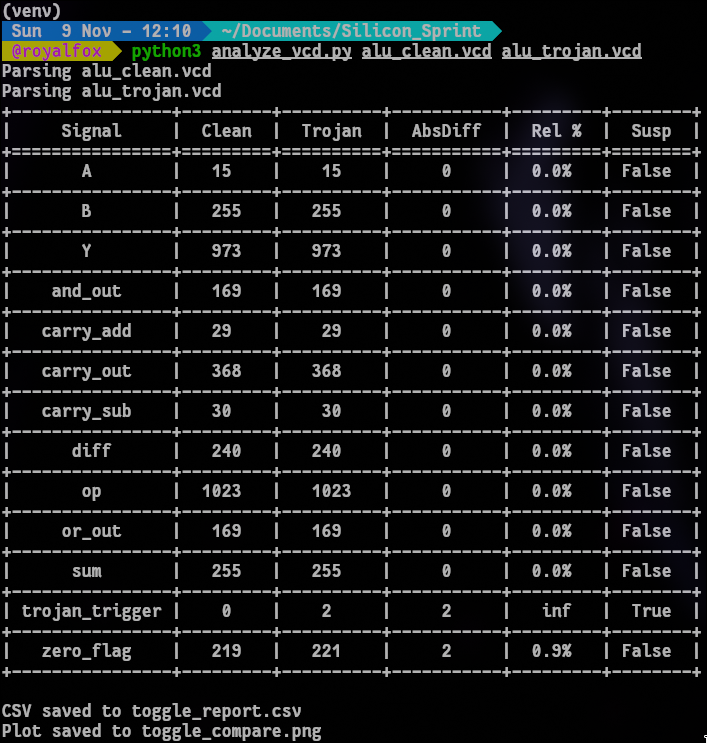
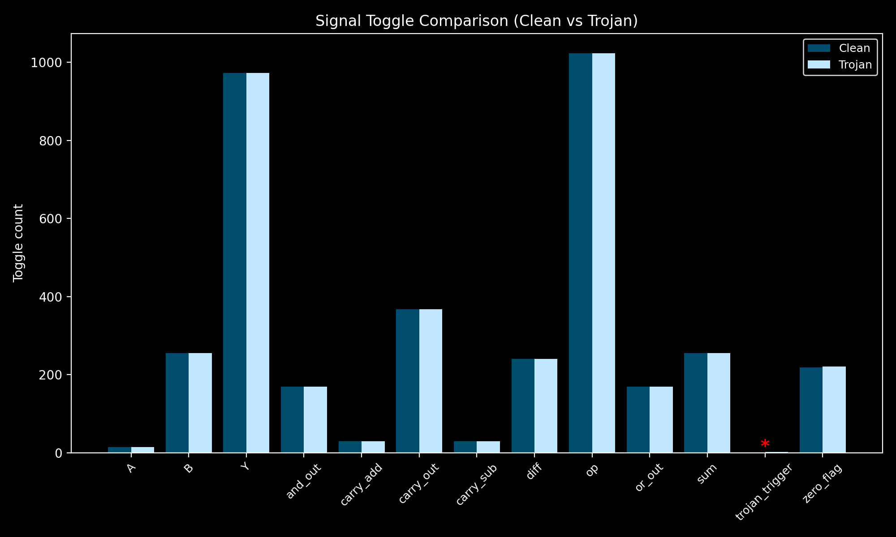

# Side Channel Analysis of Trojan ALU

## Usage Instructions

**Step 0** - Transfer the contents of Analysis_Script folder to the Verilog_Design folder

**Step 1**- Install requirements from requirements.txt

`pip install -r requirements.txt`

**Step 2**- Generate the Value Change Dump (Output VCDs also present in [vcd](https://github.com/akh7177/sidechannel_trojan_detection/tree/main/VCD))

`iverilog -D DUMPFILE="alu_clean.vcd" -o sim_clean.vvp alu_clean.v alu_tb.v`  
`iverilog -D DUMPFILE="alu_clean.vcd" -o sim_clean.vvp alu_clean.v alu_tb.v`

**Step 3** - Analyse the VCD files using analyze_vcd.py script

`python3 analyze_vcd.py alu_clean.vcd alu_trojan.vcd`

## Activity comparison and Visualisation

### Tabular Representation of Switching Activity Comparison 

### Graphical Representation of the Toggle Count Difference between Clean_ALU and Trojan_ALU

### CSV for further analysis

[Download Toggle Report (CSV)](OupPut_Files/output.csv)

##
